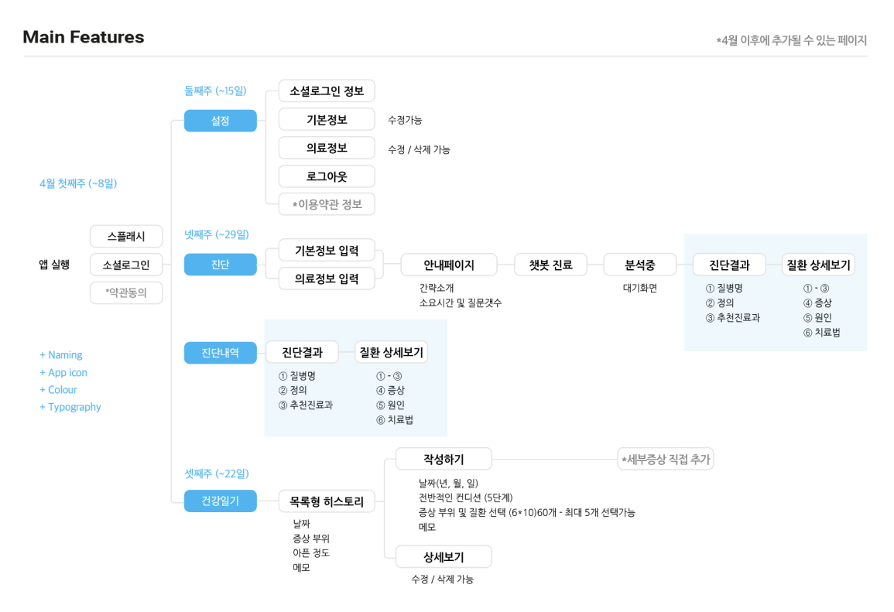

# Apzima 아프지마
세종대학교 2022-1 캡스톤디자인 팀프로젝트
- 기간 : 2022.03 - 2022.06
- 주제 : 의료 AI 챗봇
- 팀 명 : 컴백홈
- 팀 구성
  - 프론트(팀장) : 오다혜
  - 백엔드 : 최준성
  - AI : 이지웅, 김다슬
## 사용 기술
- 프론트 : `React Native(Expo)`
- 백엔드 : `Spring`, `AWS`
- AI : `Flask`
- 협업 기술(tools) : `Notion`, `postman`, `figma`
## 주요 기능
### 채팅 기반 사용자 병명 예측
- 의의
  - 거동이 불편하거나, 병원을 방문하기에 시공간적 여유가 없는 경우 AI와의 채팅을 통해서 자신의 증상과 관련된 병을 분석 받을 수 있음. 
- 기능
  - 자신의 신체적인 정보(키, 몸무게 등) 및 진단 시 필요한 정보를 사용자로부터 입력 받음. 
  - 사용자가 입력한 정보에 기반하여 AI 모델이 분석 후 가장 유사도가 높은 병 3개 추천
  - AI가 분석한 병에 대한 각종 정보를 사용자에게 제공

### 아픔 증상 기록장
- 의의
  - 통증이나 아픈 증상이 나타났을 때마다 기록을 함으로써 추후 병원 진료 진단 시 의사에게 제공함으로써 진단의 정확도를 높일 수 있도록 함
- 기능
  - 증상 목록 중 해당하는 증상을 선택하거나 직접 증상을 기록하고 저장하면 선택한 날짜에 해당 정보가 저장됨
  - 기록 수정 및 삭제

> _추후 해당 프로젝트 확장 가능한 기능_
- 실제로 진단 받은 병명을 입력함으로써 기록했던 증상과 병 간의 관련성을 높이고, 이를 다시 피드백하여 AI 진료의 근거로 사용 및 진단 정확도를 높이는 기능
- 진료를 보는 의사에게 자동으로 증상 기록이 연동되는 시스템

## 프로젝트 구조

